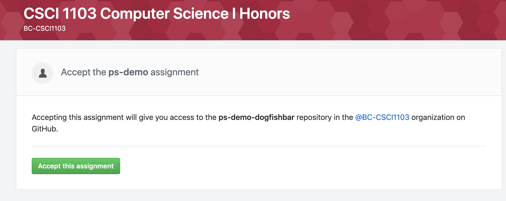
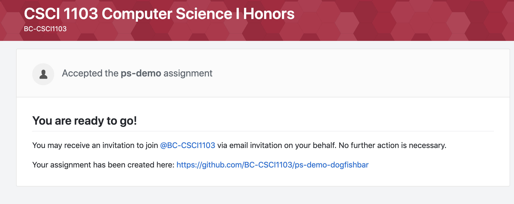
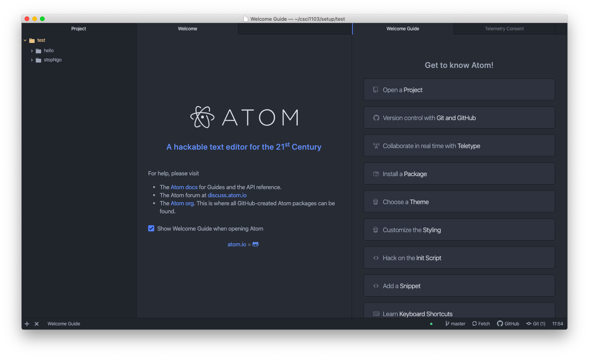
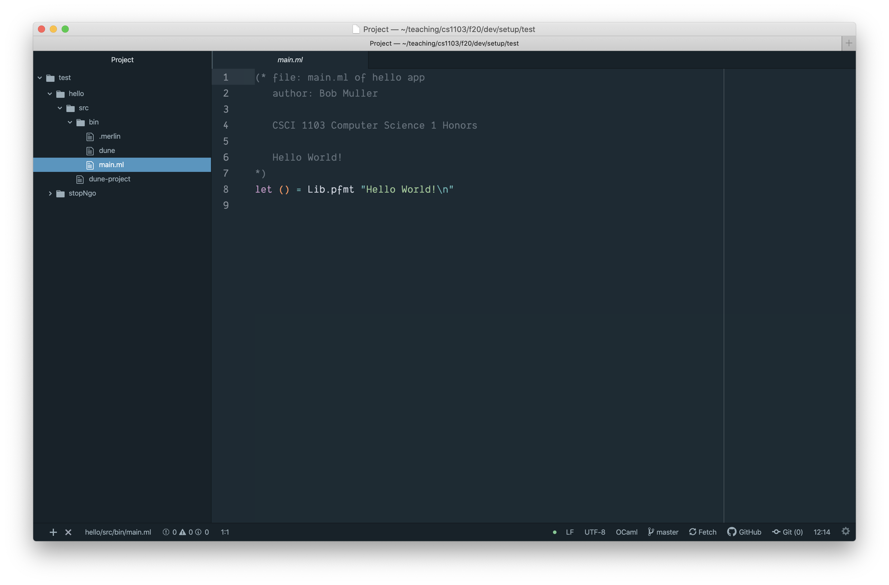
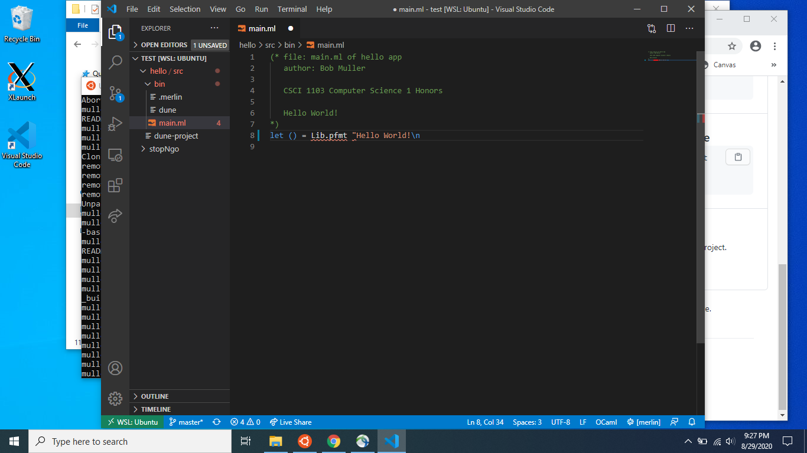
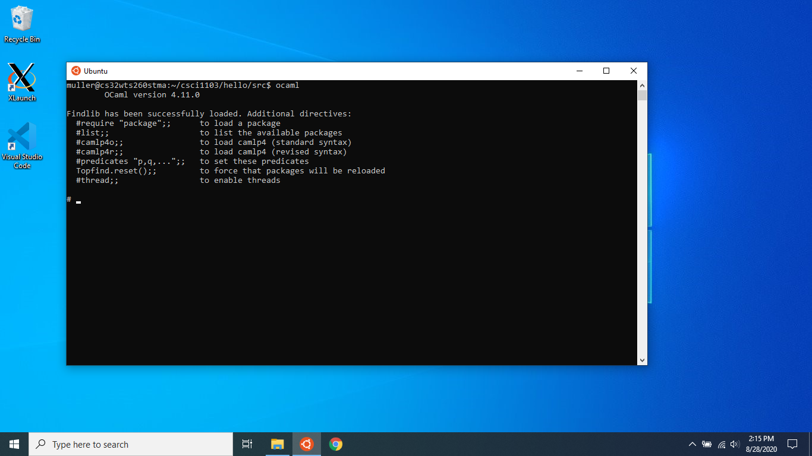
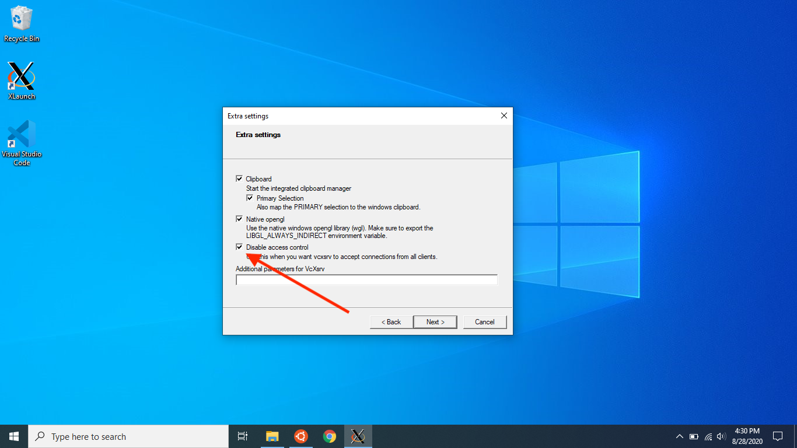
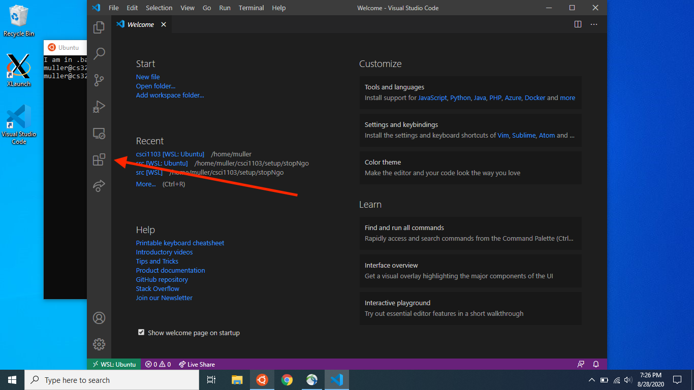
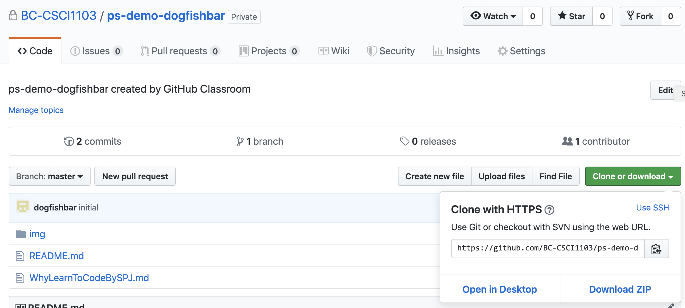

# CSCI 1103 Computer Science 1 Honors

### Fall 2020

Robert Muller - Boston College

------

## Problem Set 1 : Getting Started

### (8 Points)

### Due Wednesday September 9, 2020, Midnight

The purpose of this problem set is to help you with your system setup and with breaking the ice with coding in OCaml. There are 2 parts: *system setup* and then *four simple coding problems*.

## Part 1: System Setup

In this course, we'll be developing code in a Unix environment on either MacOS Catalina or on a Windows 10 system. If you have an older version of one of these operating systems, it would be best to upgrade your operating system before proceeding further with this problem set. If you cannot upgrade for one reason or another, please get in touch with the instructor.

The coding environment that we're going to install has a lot of parts and the installation process involves many steps that have to be carried out carefully and exactly as specified. Some of the installation steps take a long time so set aside plenty of time for this work. If you run into problems with the installation process, please get in touch with a course staffer. Many of the installation steps will involve using a *command shell* to issue commands to the operating system. Command shells may be new for you, but the Unix command shell is quite powerful and widely used so learning to work with a command shell will be a good skill to develop in its own right.

### Work Flow

The basic flow of work for the course will be as follows. From time to time, you'll receive an email from GitHub Classroom with an invitation to accept a problem set. The email will look something like this:



When you accept the invitation, GitHub Classroom will made a private copy of the problem set for you in a *repository* on GitHub and provide you with a URL link to that repo.



So now you have your own private repository containing your copy of the problem set. (Well, your repo is mostly *private*, it's shared only with the course staff.) Your repo is hosted along with all of the others on our course GitHub site `https://github.com/BC-CSCI1103/`. If you visit that site, you'll see just a few repos, the ones that are privately owned by you and those that are public.

We'll come back to the discussion of the course workflow after we've set up the software on your computer.

## Setup for MacOS Catalina (10.15)

+ **If you're using a Windows system, skip this section -- scroll down to *Setup for Windows 10*.**
+ **If you're using a Mac running on older version of MacOS such as MacOS Mojave (10.14), consider upgrading your version of MacOS to Catalina. It's free in the App Store. If you upgrade, it's important that you complete the upgrade before following any of the steps below.**
+ **The installation process for Macs requires the installation of Xcode Developer Tools for Apple's App Store. Xcode requires around 8 Gigabytes of storage.**

---

### Setting up your Work Area

1. We're going to be using the MacOS **Terminal** application as our Unix command shell. We'll be using it often so it would be wise to copy the icon for the Terminal application 

    

   to your taskbar. The Terminal icon can be found using the Finder. Select *Applications* (on the left) then scroll down and select *Utilities*, then scroll down to find Terminal. Drag the icon to the taskbar. Now fire up the terminal by selecting the icon. The window generated by the app is a Unix command shell.

2. Most operating systems use a tree-structured hierarchy of *directories* (aka *folders*) for organizing resources. Each user is assigned a *home directory* where they can organize their files and subdirectories. When a user is interacting with the operating system via a command shell, In addition to a home directory, the user will also have a *current working directory*.

   We'll use the `$` symbol below for the command shell prompt. Type `cd` and then hit the `return` key.

   ```bash
   $ cd
   ```

   This is the *change directory* command. Typed in this simple way with just the two letters, it assigns the home directory as the current working directory. We can see the current working directory using the *print working directory* command `pwd`:

   ```bash
   $ pwd
   /Users/muller
   ```

   The `pwd` command displays a *file path* `/Users/muller` confirming that the current working directory is the (i.e., my) home directory. If you want to see what's in the current working directory you can use the *list* command `ls`:

   ```bash
   $ ls
   Applications/	Downloads/	Music/		Sites/		bin/		github/		teaching/
   Desktop/	Google Drive/	Pictures/	Web/		cartoons/	lib/		test/
   Developer/	Library/	Portal/		admin/		docs/		personal/	tmp/
   Documents/	Movies/		Public/		attic/		forms/		research/
   $ 
   ```

   The command `mkdir`  is the *make directory* command, it introduces a new directory in the current working directory. Let's make a work area for the materials developed in this class. (We'll sometimes refer to this new directory as the course home directory.)

   ```bash
   $ mkdir csci1103
   ```

   Done in this way, you can always navigate to our course home directory by typing

   ```bash
   $ cd
   $ cd csci1103
   $ pwd
   $ /Users/muller/csci1103
   ```


### Setting up the OCaml Ecosystem

1.  Visit Apple's App Store and install Xcode Developer Tools version 11.6.

2. Now use the Unix `git` command to retrieve some setup tools from our course site on GitHub. 

   >  Heads up! The best way to issue these commands accurately is to copy the line and paste it into your command shell.

   ```bash
   $ git clone https://github.com/BC-CSCI1103/setup.git
   ```

3. Install [MacPorts](https://www.macports.org/install.php), a utility for managing software packages on Macs.

   > Heads up! Do you already use another package manager such as Homebrew? If so, be aware that some of our course software doesn't work when supporting software has been installed with Homebrew. For the purposes of this course, please use MacPorts.

   After installing MacPorts, X-out your command shell and start a new one.

4. Fire up the Terminal app and use MacPorts to install OCaml's package manager `opam` and a graphics support library `lablgtk`. 

   > Heads up! Note that the MacPorts app is invoked from the Unix command line as `port`. Also, you'll have to use `sudo` as shown, this will require you to enter your password.

   ```bash
   $ sudo port install opam
   ...
   $ sudo port install lablgtk2
   ```

5. Initialize `opam`.

   > Heads up! Best to copy and paste -- the two quote marks in the `eval` command below are *backquotes* (upper left, below the `esc` key). This won't work if you type the normal single-quote marks.

   ```bash
   $ opam init
   $ eval `opam config env`
   ```

6. The process of installing OCaml's package manager `opam`, also installs the other main parts of the OCaml system. Fire up the OCaml interpreter to confirm that it's working.

   ```bash
   $ ocaml
   ```

   You should see something like:

   ```ocaml
   OCaml version 4.11.0
   # 2 + 3;;
   - : int = 5
   ```

   You can type in expressions as you like, ending them with two consecutive semi-colons `;;`.  

   Type `Ctrl-d` (i.e., hold down the `Control` key and while still holding it, type the `d` key) to exit the REPL.

7. Install various OCaml packages. This is taken care of for you in a `configure` script. Type exactly:

   ```bash
   $ cd
   $ cd csci1103
   $ cd setup
   $ ./configure
   ```

8. Test your OCaml setup. Type

   ```bash
   $ cd
   $ cd csci1103
   $ cd setup/test/stopNgo/src
   $ dune exec bin/main.exe
   ```

   If you don't see a simple animation, something is wrong, contact a course staffer. If you do, try hitting the touchpad a few times to start and stop.


### Setting up the Atom Editor

The last step is setting up the code editor.

1. **Install** Download and install the [Atom editor, v 1.50.0](https://atom.io/). You're welcome to use whatever code editor you'd like: Atom, vscode, sublime text, emacs and vim all come to mind. Following the instructions here will leave you with a very serviceable Atom-based coding environment. Many CS students at BC use Atom for all of their CS courses at BC. 

   After you've installed Atom, open your Applications folder to ensure that Atom has been installed there. You should see the Atom icon

   

   If you don't see it there, drag it there. Also consider dragging the icon to your task bar.

2. **Configure** Atom is an "extensible" editor. This means that it has processes in place for people to write and install *packages* of code that tailor the editor for particular applications. Executing the following command will install a number of packages that tailor Atom for OCaml.

   ```bash
   $ cd
   $ cd csci1103/setup
   $ ./configureAtom
   ```

3. **Test** Now we can test whether or not your editor settings are working. Move to the testing area by typing:

   ```bash
   $ cd
   $ cd csci1103/setup/test/
   ```

   Now fire up the Atom editor from the unix command shell by typing:

   ```bash
   $ atom .
   ```

   >  If this command doesn't work for you, Atom's installation script hasn't created a link for you. You can do that by hand with
   >
   >  ```bash
   >  $ ln -s /Applications/Atom.app/Contents/Resources/app/atom.sh /usr/local/bin/atom
   >  ```

   You should see Atom's welcome page with three or four tabs, `Project`, `Welcome` and `Welcome Guide`. (There may also be one related to "Telemetry".)

   

   Dismiss all but the `Project` tab by X-ing them out (upper right). Now open the `hello` directory, then `src` then `bin` then select `main.ml`. You should see this

   
   
   The tab labeled `main.ml` is displaying OCaml code. This code can be executed by using OCaml's *build manager* `dune`. In the command shell, type
   
   ```bash
   $ cd
   $ cd csci1103/setup/test/hello/src
   $ dune exec bin/main.exe
   ```
   
   > Heads up! The bit on the last line must say `bin/main.exe` even though the `bin` folder has a file named `main.ml`.
   
   Introduce an error in this code by deleting the quotation mark at the end of line 8. You should see
   
   
   
   the red dot on line 8 indicates that the OCaml editor support packages have found a problem with your code. Generally speaking, you'll want to make sure that your Atom editor window is free of these errors (i.e., no red dots!). If you restore the quotation mark the red dot will disappear. 
   
   If you don't see this behavior, contact a course staffer. If you do, great! You're alll done! Scan down to **Finishing up the Workflow** below.

---

## Setup for Windows 10

> + **These instructions presume that you are running Windows 10. If you are running an earlier version of Windows, these instructions will not work.**
> + These instructions are rather lengthy and detailed. It's important to follow them carefully. Contact a course staffer if you run into problems. 

The basic idea is to make use of the Windows Subsystem for Linux (WSL) and Microsoft's vscode editor. Our setup has 5 parts:

1. Enable Windows Subsystem for Linux (WSL) and Install Ubuntu
2. Set up your Work Area
3. Set up the Basic OCaml Ecosystem
4. Add Support for Graphical Applications
5. Install and Configure the vscode Editor

### 1. Enable Windows Subsystem for Linux (WSL) and Install Ubuntu

Follow the instructions in the [Solarian Programmer WSL Tutorial](https://solarianprogrammer.com/2017/04/15/install-wsl-windows-subsystem-for-linux/) to enable WSL on Windows 10 and to install the Ubuntu version of the Linux operating system. 

>  Heads up! Don’t forget the password for the Linux account you’ve just created: you'll need it to install some software. 

At this point, you should be able to run a “bare-bones” Ubuntu Linux terminal as an application within your WSL system. Most operating systems use a tree-structured hierarchy of *directories* (aka *folders*) for organizing resources. Each user is assigned a *home directory* where they can organize their files and subdirectories. Type the *print working directory* command `pwd` in response to the `$` command prompt:

```bash
$ pwd
/Users/muller
$
```

This shows that my Ubuntu home directory is `/Users/muller`. A string of this form is called a *file path*. My Windows home directory is elsewhere, back to that in a minute. One can see what files and directories are contained within a directory using the *list* command `ls`:

```bash
$ ls
Desktop Documents Downloads Music Pictures Public Templates Videos
$
```

When a user is interacting with the operating system via a command shell, in addition to a home directory, the user will also have a *current working directory*. The current working directory may be the home directory or it might be some other directory. The current working directory is shown using the `pwd` command and can be changed via the *change directory* command `cd`.

```bash
$ cd
$ pwd
/Users/muller         # Your Ubuntu username will appear here rather than muller
$ cd Downloads
$ pwd
/Users/muller/Downloads
$ cd ..
$ pwd
/Users/muller
```

Note that the command `cd` sets the current working directory to the home directory and the command `cd ..` moves up the tree one level.

You can access your Windows home directory from WSL Linux via the path `/mnt/c/Users/YOUR_WINDOWS_NAME/` where `YOUR_WINDOWS_NAME` is your Windows user name. It's convenient to make a link for it, so you could access it quickly, for instance, calling it `windows`. This is how to create such a link:

 ```bash
$ cd
$ ln -s /mnt/c/Users/YOUR_WINDOWS_NAME/ windows
 ```

Now you can navigate to you Windows home folder via 
 ```bash
$ cd ~/windows
 ```

and to your Linux home folder via

```bash
$ cd
```

The steps we've taken leave us with a bare-bones WSL installation of Ubuntu without support for a graphical interface. We'll come back to that shortly.

### 2. Set up your Work Area

We'll make a directory `csci1103` to house your work in this course. 

1. Type

   ```bash
   $ cd
   $ pwd
   /Users/muller          
   $ mkdir csci1103       
   ```

   You can always move to your `csci1103` course home directory by typing

   ```bash
   $ cd
   $ cd csci1103
   ```

2. Now use the Unix `git` command to retrieve a setup tool from the course site on GitHub:

   ```bash
   $ git clone https://github.com/BC-CSCI1103/setup.git
   ```

### 3. Set up the Basic OCaml Ecosystem

The OCaml ecosystem has 3 major parts:

1. A suite of compilers and interpreters implementing the OCaml programming language;
2. A *package manager* called [opam](https://opam.ocaml.org/); this manages libraries of OCaml code.
3. A *build manager* called [dune](https://dune.build/); this manages the compilation and execution of OCaml code.

Many of the OCaml tools and packages rely on lower-level operating system tools and packages. We'll use Ubuntu's *advanced package tool* `apt` to install several of these tools, including OCaml's package manager `opam`. Then we'll use OCaml's `opam` package manager to install the OCaml packages that we need for the course. Generally speaking, you should respond affirmatively when prompted.

1. First, install several of Ubuntu's packages. 

   > Heads up! Probably best to just copy the first line and paste it into your command shell.

   ```bash
   $ sudo apt install m4 pkg-config libcairo2-dev libgnomecanvas2-dev
   ... the first use of sudo will require you to type your new Ubuntu password ...
   ```

2. Install the OCaml package manager `opam`.

   ```bash
   $ sudo add-apt-repository ppa:avsm/ppa
   $ sudo apt-get update
   $ sudo apt install opam
   ```

   Some of the above may indicate errors, but I found that ignoring the errors and completing the last line worked out.

3. Initialize the `opam` package manager:

   > **Heads up! The two quote marks in the `eval` command below are *backquotes* (upper left, below the `esc` key).**

   ```bash
   $ opam init --disable-sandboxing
   $ eval `opam config env`
   ```

   Exit the Ubuntu shell and restart Ubuntu to fire up a new shell. 

4. Installing and initializing opam also installs the OCaml compiler `ocamlc` and the OCaml interpreter `ocaml`. Fire up the interpreter by typing its name

   ```bash
   $ ocaml
   ```

   You should see something like this

   

   Type in an arithmetic expression or two, each followed by two consecutive semicolons `;;`. Type `ctrl-d` to exit the interpreter.

5. Now execute the course `configure` script to install several OCaml packages: `dune`, `merlin`, `animate`, etc.

   ```bash
   $ cd
   $ cd csci1103/setup
   $ ./configure
   ... Y to all ...
   ```

6. Now test the basic installation. Use the `dune` build manager to compile and run the sample `hello` program as follows:

7. ```bash
   $ cd
   $ cd csci1103/setup/test/hello/src
   $ dune exec bin/main.exe 
   ```

   If you see *"Hello World!"*, great! Press on. If you don't, something is amiss, contact a course staffer.

### 4. Add Support for Graphical Programs

The configuration developed so far is fine for running OCaml programs on WSL. But WSL doesn't provide support for graphical applications. In order to run graphical applications under WSL, we'll need to install a windowing system. We'll use the tried and true X-Windows system, aka *X11*,  (which isn't related to Microsoft Windows). In order to use it, we'll have to complete 2 steps:

1. Install *server* software for X-Windows, a so-called X-server;
2. Configure our Unix command shell (i.e., bash) to tell graphical applications to use the newly installed X-server.

#### Install the VcXsrv X-server

There are many X-servers out there, for this course we'll use [VcXsrv](https://sourceforge.net/projects/vcxsrv/). Download and install it (using your Windows browser). The VcXsrv server includes a window launcher utility called *XLaunch*. Find the XLaunch shortcut on the Desktop or in the Start Menu, and click it. You'll be greeted by a simple setup wizard. Accept the default options on the first two pages (i.e., *Multiple windows* then *Start no client*). **On page 3, select the *Disable access control* check box.**



You can always start the X-server by double-clicking its icon. If you don't want the hassle, on page 4 of the setup wizard, select the ***Save configuration*** button. This will display a Save configuration page that will allow you to save the choices you just made in a file called `config`. (Actually, the name of the file is `config.xlaunch` but the system hides the `.xlaunch` part.) Where to put the `config` file? Use the controls in the Save configuration page to navigate through the Windows file system to the following `Startup` directory:

```bash
C:\Users\YOUR_WINDOWS_NAME\AppData\Roaming\Microsoft\Windows\Start Menu\Programs\Startup\
```

>  + Heads up! Note that `YOUR_WINDOWS_NAME` is your Windows account name, not your Ubuntu name!
>
>  + Not being a Windows user, I found it difficult to navigate to the above folder using the Windows controls. So I saved the `config.xlaunch` file on the Windows Desktop and then moved it using the Unix *move* command `mv` command.
>
>    ```bash
>    ... having already saved the config.xlaunch file to my Windows Desktop ...
>    $ cd /mnt/c/Users/MY_WINDOWS_NAME 
>    $ mv Desktop/config.xlaunch ./AppData/Roaming/Microsoft/Windows/Start\ Menu/Programs/Startup/
>    ```

If you save your `config` file in that `Startup` directory, the X-server will start automatically for you on system startup and you won't have to hassle with starting it by hand anymore.

Once the X-server is launched, an X icon will appear in your system tray. If you want to run a graphical application and you don't see the X icon in the starter tray, you can start the X-server by hand by double-clicking the XLaunch icon.

#### Configure the Command Shell to use the X-server

In an Ubuntu command shell, carefully type or cut and paste the following:

```bash
$ cd
$ echo "export DISPLAY=localhost:0.0" >> .bash_profile
$ echo "eval $(opam env)" >> .bash_profile
$ source .bash_profile
```

These commands insert two command lines into your `.bash_profile` file in your Unix home directory. The commands in the `.bash_profile` file are executed every time you start up an Ubuntu command shell.

#### Test a Graphical Application

OK, are we good to go? Let's try a standard X11 graphical application. Grab one from the internet by typing:

```bash
$ sudo apt-get install x11-apps
$ xeyes
```

A new window should open, containing a pair of eyes that follow your mouse movements. OK, close it. Let's try something a little more ambitious. Type

```bash
$ cd
$ cd csci1103/setup/test/stopNgo/src
```

Now use the `dune` build manager to build and run the `stopNGo` program:

```bash
$ dune exec bin/main.exe
```

If you have trouble with any of the above steps, get in touch with course staff.

### 5. Install and Configure the vscode Editor

You made it this far, great job! The last step is to install Microsoft's **vscode** editor. Fire up a browser in Windows and [install vscode](https://code.visualstudio.com/download) **for Windows**. Now fire up vscode on Windows by selecting the vscode icon, it should be on your Desktop.

We're now going to install several *Extensions* that customize vscode to work well with OCaml (Extensions are known as *Packages* in Atom). You can search for Extensions in vscode by selecting the blocky icon on the left.



Typing `@installed` in the search box at the top left lists all of the already-installed Extensions. 

When you fire up vscode, it will notice that you have enabled WSL so it will recommend that you install the **Remote - WSL** Extension. Install the following Extensions:

1. Remote - WSL (from Microsoft, v 0.44.4 or better)
2. Remote Development (from Microsoft, v 0.20.0 or better)
3. OCaml and Reason IDE (from Darin Morrison, v 1.038 or better)
4. Live Share (from Microsoft, v 1.02731 or better)

Select the **Ocaml and Reason IDE** Extension, it should have a green button for **installing it on WSL**. It's important that you select that button. Exit vscode.

> If you don't see the green button, restart your computer and try again.

Let's see if it's working, in an Ubuntu shell, type:

```bash
$ cd
$ cd csci1103/setup/test/hello
$ code .
```

> Heads up! This last line is tricky! You're firing up the Windows-based vscode graphical editor but you're doing it from WSL.

Navigate to the file `/bin/main.ml`. You should see something like


Note the annotations `OCaml` and `merlin` on the right in the blue bar on the bottom. 

Merlin is the wizard of errors. (!) If you introduce an error, say, by deleting the quotation mark at the end of line 8, you should see an orange squiggle below and a small red highlight bar on the right, as in


This is an indication that merlin has detected a mistake. If you restore the correct code by reintroducing the quotation mark, the error annotations should disappear.

---

So no we have the development process:

1. Open a command shell in Ubuntu;

2. Use the Unix `cd` command to navigate to the `src` directory of the project that you're working on;

   ```bash
   > cd
   > cd csci1103/ps1-dogfishbar/src             # for example
   ```

3. fire up `vscode` from WSL by issuing the Unix command

   ```bash
   $ code .
   ```

4. Write your OCaml code;

5. When your code seems worth testing (i.e., merlin isn't flagging errors) and you think it might be reasonable, use `dune` to build and run it:

   ```bash
   $ dune exec bin/main.exe
   ```

6. If it works, great! For submission instructions, read on. If your code doesn't work, return the the editor...

---

## Finishing up the Workflow

Back to the problem set. Whether you're using Windows or MacOS, you can make a local *clone* of your problem set repository on your laptop. Fire up your web browser and visit the course website `https://github.com/BC-CSCI1103/` and scroll down to your repo for pset 1 (mine would be called `ps1-dogfishbar`). Select the green **Clone or download** button.



Copy the web URL of the repo to your clipboard. Then, fire up a Unix command shell and make a local clone of the repo by typing the `git clone` command:

```bash
$ cd
$ cd csci1103
$ git clone https://github.com/BC-CSCI1103/ps-demo-dogfishbar.git
```

Of course, rather than `ps-demo-dogfishbar.git`, the rightmost bit for you will have something like `ps1-smith.git` rather than `ps-demo-dogfishbar.git`. The `git clone` command  will cause the `git` and `GitHub` systems to make a local copy of your remote (master) repo. The repo for ps1 has four items:

1. a writeup in the form of this `README.md` file,
2. a hidden `.gitignore` file,
3. an `img/` folder containing the images shown above, and
4. a `src/` folder for code. A `src/` folder will usually have a `dune-project` file and a `bin` directory. The `bin` directory will typically have OCaml "harness" code — code that isn't finished.

The distributed source code should always compile and run. Type

```bash
$ cd
$ d csci1103/ps1-YOUR_GITHUB_ID/
$ cd src
$ dune exec bin/main.exe
```

The unix `dune` command builds (i.e., compiles and links) executable code. All of the projects for this course will be distributed with working `dune` files. 

### Wrapping Up

To review, you'll use the [atom](https://atom.io/) or [vscode](https://code.visualstudio.com/) text editor to develop your problem set solutions and you'll use `dune` to compile and test your work. As you work on your code, you should use Unix's `git` commands `git add` and `git commit` to commit your work to your local git repository periodically.

When your code is working (and looks great!) you can submit it for grading using `git push` to transfer your local working repository to your master problem set repository on the Github course website.

```bash
$ cd
$ cd csci1103/ps1-YOUR_GITHUB_ID/
$ git push
```

After reviewing your work, course staff will leave comments and record your problem set score in the local BC [gradebook on Canvas](https://bostoncollege.instructure.com/courses/1614229/). 

---

# Part 2: Four Simple Coding Problems

Now that you've cloned your repo for problem set one, you're ready to get to work. Fire up a terminal shell and then use the unix `cd` command to change your working directory to the `src/` directory for the present pset, then fire up the editor, either Atom or VSCode:

```bash
$ cd
$ cd csci1103/ps1-smith/src/
$ atom .
```

​	Open the `bin/main.ml` file. You'll see that it contains stub definitions for each of the names (i.e.,  `helloWorld`, `golden`, `hypotenuse` and `yellowCircle`). As you will eventually see, we'll specify these definitions along the lines of:

```ocaml
   val helloWorld : unit -> string
   val golden : unit -> float
   val hypotenuse : float -> float -> float
   
   val yellowCircle : unit -> unit            (* OPTIONAL *)
```

Your task in this problem set is to modify the stub definitions of these functions so that they work correctly. For example, scroll down to the line of `main.ml` containing:

```ocaml
let helloWorld () : string = failwith "Problem 1 not implemented"
```
Your job is to replace everything from `failwith` on to the right, with something that would yield the string `"Hello World!"`. (It's super easy!)

Finally to some actual coding! There are three required problems and one optional problem. 

---

1. Implement the function

```ocaml
val helloWorld : unit -> string
```
The `helloWorld` function accepts no arguments and simply returns the string `"Hello World!"`.

2. The golden ratio, aka *phi* or , is computed by (1 + √ 5) / 2.0. Write an OCaml function

```ocaml
val golden : unit -> float
```
It accepts no arguments and returns the golden ratio. OCaml's pervasive library function `sqrt` can be used in computing the result. You can try `sqrt` out by firing up an OCaml REPL from the Unix command line:

```bash
$ ocaml
OCaml version 4.11.0

Findlib has been successfully loaded. Additional directives:
  #require "package";;      to load a package
  #list;;                   to list the available packages
  #camlp4o;;                to load camlp4 (standard syntax)
  #camlp4r;;                to load camlp4 (revised syntax)
  #predicates "p,q,...";;   to set these predicates
  Topfind.reset();;         to force that packages will be reloaded
  #thread;;                 to enable threads

# sqrt(5.0);;
- : float = 2.23606797749979

# 1 / sqrt(5.0);;
Error: This expression has type float but an expression was expected of type int

# 1.0 /. sqrt(5.0);;
- : float = 0.447213595499957928
```

3. Write an OCaml function

```ocaml
val hypotenuse : float -> float -> float
```
that accepts a two floating point numbers `base` and `height` giving the base and height of a right-triangle and uses the Pythagorean Theorem to return the length of the hypotenuse.

4. The `Color.makeColor` function accepts three non-negative integers in the  range 0 through 255, as in

   ```ocaml
   (Color.makeColor red-amount green-amount blue-amount)
   ```

   Given the three inputs, `Color.makeColor` returns a color. The function call `(Color.makeColor 0 0 0)` produces black. The call `(Color.makeColor 255 255 255)` produces white. The function `yellowCircle` should use the `Animate` library to create picture with a large yellow circle in the display. The current definition is:

```ocaml
let width = 600
let height = width
let radius = width / 2
let color = Color.makeColor 255 0 0

let draw ignore = Image.circle radius color

let yellowCircle() : unit =
  Animate.start ()
    ~name: "Yellow Circle"
    ~view: draw
    ~width: width
    ~height: height
```

Modify the definition to draw a yellow circle instead of a red one.

Try one function at a time. Once you've got the first one working you're going to want to try it out. If you retrieve the terminal window, you can type

```bash
$ dune exec build/main.exe
```

to see if it works. Once the first one is working, move on to the second one. Once you have all of your functions working, use the unix `git` commands to submit  your work as follows:

```bash
$ dune clean
$ git add bin/main.ml
$ git commit -m "YOUR NAME: final"
$ git push
```

where `YOUR NAME` is your actual name (first and last). Voila! You're done!